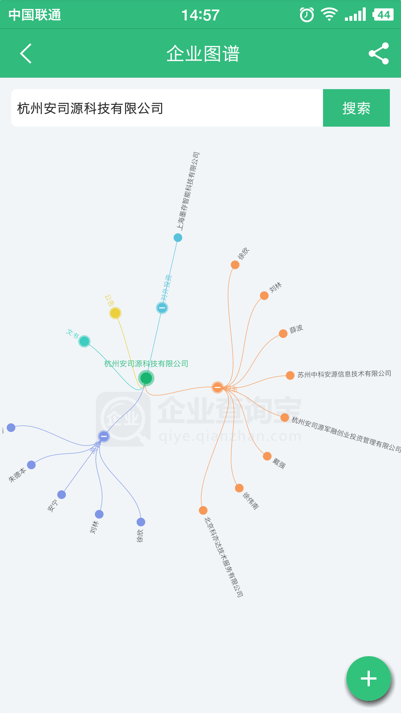
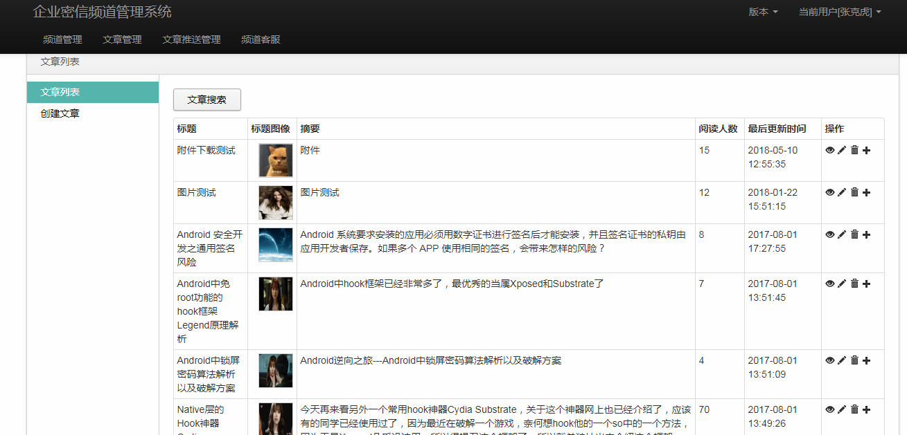

### 公司简介

 

杭州安司源科技公司致力于安全通信解决方案的发展与推广。

#### 资产组成

### 主打产品

- 面向大众  - 安思密信
- 面向企业  企业密信

##### 1. 安思密信

安司密信（[AKeyChat](http://www.akey.me/)）是杭州安司源科技有限公司为适应移动办公[BYOD](https://baike.baidu.com/item/BYOD/6325971)需要，面向现代企业推出的加密即时通信应用，可实现企业高效，安全的业务沟通交流。  安司密信App支持主流的即时通讯特性，包括语音、文本、图片、短视频、文件等即时信息发送以及网络通话功能，所有数据都经过安司密盾的高强度加密，可以有效抵御外部黑客和第三方组织恶意攻击。为适应企业内部对信息传播的管控需要，安司密信提供了强大的信息掌控能力，包括支持阅后即焚、远程撤销、阅读/销毁回执、只读信息、一次性会话（即时会话）等 

- 一款安全的内部通讯软件 
- 用户量  - 30万

##### 2. 企业密信

- 公司用户, 主要盈利来源
- 面向公司或者政府根据其需求来定制功能和样式的企业内部交流通讯软件

### 人员组成

#### 杭州

- 去年新建了总部
- 今年5月份装修完毕, 转移一部分到杭州, 但上海的办公地点还会保留

#### 上海

- 主要研发

高铁 半个小时 到上海

  大概有 20 人 左右

运营 :  2 

产品 :  1

开发 :   5     前端  ios    O-C  1  Swift  1     c ++ 

java-EE : 开发功能    

python :   服务器   服务器后台管理页面

老板:  徐欣   法人代表

CEO  刘凌

### 我的职责

python :   服务器   

- 服务器后台管理页面

