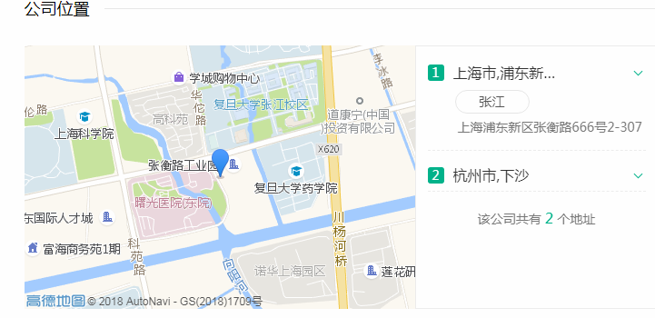
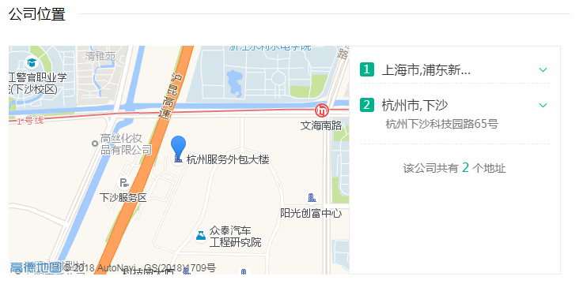

### 公司简介

 

杭州安司源科技公司致力于安全通信解决方案的发展与推广。安司密信（[AKeyChat](http://www.akey.me/)）是杭州安司源科技有限公司为适应移动办公[BYOD](https://baike.baidu.com/item/BYOD/6325971)需要，面向现代企业推出的加密即时通信应用，可实现企业高效，安全的业务沟通交流。  安司密信App支持主流的即时通讯特性，包括语音、文本、图片、短视频、文件等即时信息发送以及网络通话功能，所有数据都经过安司密盾的高强度加密，可以有效抵御外部黑客和第三方组织恶意攻击。为适应企业内部对信息传播的管控需要，安司密信提供了强大的信息掌控能力，包括支持阅后即焚、远程撤销、阅读/销毁回执、只读信息、一次性会话（即时会话）等 

### 主打产品

#### 安思密信

- 介绍

一款安全的内部通讯软件,

- 用户量

- 主要用户群体

- 

### 盈利模式

### 人员组成

#### 上海

运营: 

产品: 

开发: 

java: 

python: 

安卓: 

运维: 

### 我的职责

