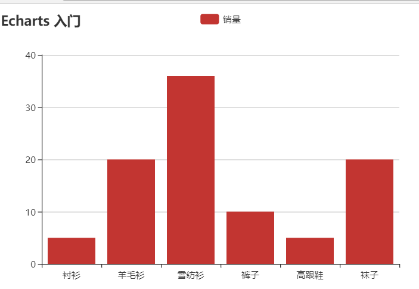

### Echarts的使用

[官方文档](http://echarts.baidu.com/tutorial.html#%E4%B8%AA%E6%80%A7%E5%8C%96%E5%9B%BE%E8%A1%A8%E7%9A%84%E6%A0%B7%E5%BC%8F)


#### [饼图 南丁格尔图](http://echarts.baidu.com/tutorial.html#%E4%B8%AA%E6%80%A7%E5%8C%96%E5%9B%BE%E8%A1%A8%E7%9A%84%E6%A0%B7%E5%BC%8F)

#### [Ajax异步加载数据](http://echarts.baidu.com/tutorial.html#%E5%BC%82%E6%AD%A5%E6%95%B0%E6%8D%AE%E5%8A%A0%E8%BD%BD%E5%92%8C%E6%9B%B4%E6%96%B0)


#### 绘制见简单的柱状图

```html
<!DOCTYPE html>
<html>
	<head>
		<meta charset="UTF-8">
		<title>Ecahrt</title>
		<script src="js/echarts.min.js"></script>
	</head>
	<body>
		<div id="main" style="width: 600px; height: 400px;"></div>
		
		<script type="text/javascript">
			var myChart = echarts.init(document.getElementById('main'))
			var option = {
				title: {
					text: 'Echarts 入门'
				},
				tooltip: {},
				legend: {
					data: ["销量"]
				},
				xAxis: {
					data: ["衬衫","羊毛衫","雪纺衫","裤子","高跟鞋","袜子"]
				},
				yAxis: {},
				series: [{
					name: '销量',
					type: 'bar',
					data: [5, 20, 36, 10, 5, 20]
				}]
			};
			
			// 使用刚制定的配置显示图标数据
			myChart.setOption(option)
			
		</script>
        
		
	</body>
</html>

```



