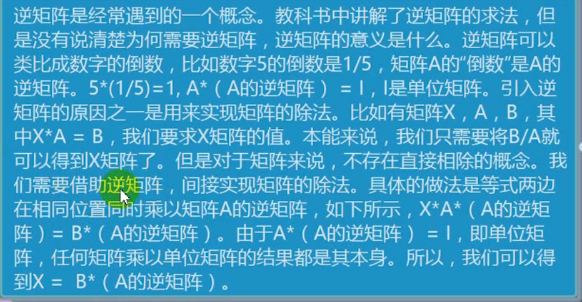
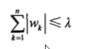

### 线性回归


##### 满秩矩阵

-  矩阵内部进行四则运算时后，行数和列数还是相同的
- 满秩矩阵求解释最精确的

##### 奇异矩阵

- 该矩阵不是满秩的，线性代数的概念
- 奇异矩阵可以通过岭回归求解


##### 判断满秩矩阵

- `np.linalg.martrix_rank(ndarry)` 查看矩阵的秩，和数组的 shape 进行对比


##### 矩阵的逆

- 矩阵本身和自身的逆矩阵相乘得到的是单位矩阵




##### 求矩阵的的逆矩阵

`n_T = np.linalg.inv(ndarray)`


### 岭回归

- 最小二乘法

岭回归是加了二阶正则项的最小二乘， 主要是用于过拟合严重和存在多重共线性，岭回归是有 bias 的，这里的 bias 是为了 vanance 更小

-   bias：
-   vanance：

引入 偏差，让数据便于计算

会将无效的系数无限向0压缩，减少无效系数的影响


- 过拟合严重： x + y = 1  2x + 2y = 2
- 多重共线： 两个正相关的属性，同时对结果进行求解
- bias ：偏差
- vanance：

一般用于样本值不够的时候，样本的特征大于样本的数量，线性回归无法正确预测


#### 参数

-   alpha 为惩罚项
-   越大，系数压索越严重， 原始系数对结果的影响变小
-   alpha=0  变为线性回归
-   越小  原始系数对结果的影响增大

```python

from sklearn.linear_model import Ridge

ridge = Ridge(alpha=1.0)  # alpha 表示的是：当维度不够时给予的补充单位矩阵
```


### lasso 回归

- 使用的是拉格朗日乘法

和岭回归的区别：

-   和岭回归类似，算法不同
-   直接对系数进行修正，而岭回归则是对系数的压缩，Lasso回归会将无用的系数修正为0， 而岭回归只会无限压缩，让系数趋近于0


-   lasso 可以将系数压缩到0，压缩系数的强度大于岭回归
-   引入惩罚项，对参数 w 增加了限定条件
-   可以认为lasso是岭回归的加强，岭回归能解决的问题也可以使用lasso回归来解决，可以通过对比模型的精度来确定哪种模型更加可靠

##### 参数 alpha：

-   越大，惩罚力度越小，原始系数对结果的影响越小
-   越小，惩罚力度越大，原始系数对结果的影响越大


### 逻辑斯蒂回归  Logistic

更具数据对分类的边界线建立回归公式，

目的主要是用于分类

属于**梯度下降算法**


##### 优缺点：

- 优点：实现简单，易于理解和实现，计算代价不高，速度快，存储资源低
- 缺点：容易欠拟合，分类的精度可能不高

`from sklearn.linear_model import LogaisticRegression`

以回归的算法实现数据的分类

c ：正则化，c 越大， 正则化越小


### make_blobs 产生数据集


`from sklearn.datasets import make_blobs`


make_blobs()

- n_samples 样本数
- n_features  特征数
- centers  中心点  `[[0, 0],[-2, -2],[3, 2]]`


#### ExtraTrees 算法

- 组合是算法，对于数据的预测，更加的精确

