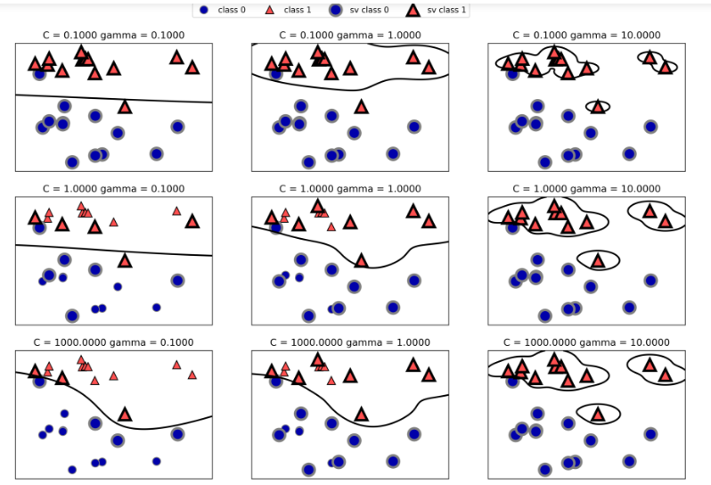

### 决策树思想


决策树（decision tree）

- 决策树是一种树结构，其每个非

决策树：信息论

逻辑斯蒂回归和贝叶斯：概率论


构造决策树：

- 分裂属性，二叉树（二分裂）

贪心算法:ID3

- ID3介绍： 就是每次需要分裂时，计算每个属性的增益率，然后选择增益率最大的进行分裂，
- 在决策树中，设D为用类别对训练元祖进行划
- 原则：将无需的数据变得有序
- 熵：信息的混乱度
- 信息熵--离散随机事件出现的概率，系统有序化程度的度量
- 信息增益：以不同属性对数据进行训练划分之后，得到的不同信息熵进行相减，信息增益就是两者的差值。


信息增益越大，说明该属性对结果的影响越大, 贪心算法会选择增益最大的属性进行计算


### 决策树算法

-   自动使用的是贪心算法，选择信息增益最大的开始

分裂属性分为三种不同的情况：
  1、属性是离散值且不要求生成二叉决策树。此时用属性的每一个划分作为一个分支。

  2、属性是离散值且要求生成二叉决策树。此时使用属性划分的一个子集进行测试，按照“属于此子集”和“不属于此子集”分成两个分支。

  3、属性是连续值。此时确定一个值作为分裂点split_point，按照>split_point和<=split_point生成两个分支。

- 参数
  - max_depth   算法的最大深度

```python

from sklearn.tree import DescionTreeClassifer

# 创建算法
tree = DecisionTreeClassifier(max_depth=5)
```


决策树预测椭圆

```python

import numpy as np
import pandas as pd
import matplotlib.pyplot as plt
from pandas import Series, DataFrame

from sklearn.tree import DecisionTreeRegressor

# 生成 -100 到 100 的值
x = 200*np.random.rand(100,1) - 100
X_train = np.sort(x, axis=0)


# 生成训练结果数据，并将其转化为点  transpose()
y_train = np.array([np.sin(X_train).ravel(), np.cos(X_train).ravel()]).transpose()
# 代表所有的点

# 添加噪声
y_train[::5] += np.random.rand(20,2)*0.2

# plt.scatter(y_train[:,0], y_train[:, 1])
# plt.axis('equal')

# 创建不同深度的决策树对数据进行学习
tree1 = DecisionTreeRegressor(max_depth=5)
tree2 = DecisionTreeRegressor(max_depth=20)
tree3 = DecisionTreeRegressor(max_depth=50)

tree1.fit(X_train, y_train)
tree2.fit(X_train, y_train)
tree3.fit(X_train, y_train)


# 创建测试数据
X_test = np.arange(-100, 100, 0.1).reshape((-1, 1))
y1_ = tree1.predict(X_test)
y2_ = tree2.predict(X_test)
y3_ = tree3.predict(X_test)

plt.figure(figsize=(12,9))
plt.subplot(221)
plt.scatter(y_train[:, 0], y_train[:, 1])
# plt.legend()

plt.subplot(222)
plt.scatter(y1_[:, 0], y1_[:, 1], label="max_depth=5")
plt.legend()

plt.subplot(223)
plt.scatter(y2_[:, 0], y2_[:, 1], label="max_depth=20")
plt.legend()

plt.subplot(224)
plt.scatter(y3_[:, 0], y3_[:, 1], label="max_depth=50")
plt.legend()
```


### 贝叶斯

概率论

在B发生的情况下A发生的概率，条件概率


#### 朴素贝叶斯

-   独立性假设，假设各个属性不想关


##### 3种贝叶斯模型

高斯分布朴素贝叶斯

`from sklearn.naive_bayes import GaussianNB`

```python

g_NB = GaussianNB()

g_NB.fit(X_train, y_train)
```


多项式分布朴素贝叶斯

- 用于文本数据


伯努利分布朴素贝叶斯

- 用于文本数据，但是表现不如多项式，适合小文本，精确度高


#### 处理文本数据

- 将文本吗拆分成单词的统计

```python

from sklearn.feature_extraction.text import TfidfVectorizer


## 使用 tf 对文本数据进行 转化

tf = TfidfVectorizer()
X_train = tf.fit(X).transform(X)

# 测试数据
sms_data =[ "Free entry in 2 a wkly comp to win FA Cup fina..."]

sms_data = tf.fit(X).transform(sms_data)
sms_data
m_NB.predict(sms_data)
```


### 支持向量机svm和KMeans


#### SVM

主要针对小样本数据进行学习、预测（有时也叫回归）的一种方法，能解决神经网络不能解决的问题，而且有很好的泛化能力

SVM由来

- 在训练过程中 SVM学习每个训练数据点对于表示两个类别之间的决策边界的重要性。通常只有一部分训练数据点对于定义决策边界来说很重要，这些点是位于类别边界上的那些点，这些点就叫做**支持向量**，支持向量机也由此得名
- 想要对新的样本点进行预测，需要测量它与每个支持向量之间的距离，分类决策时基于它与支持向量之间的距离以及在训练过程中学到的支持向量的重要性来做出的（保存在SVC的dual_coef_属性中）


支持向量、最大几何间隔、拉格朗日乘子法


`frm sklearn.svm import SVC/SVR`

SVC  -  分类

SVR  -  回归


#### SVC  回归

##### 核技巧

- 向数据中添加非线性特征，可以让线性模型变得更强大。但是会增加计算开销
- 原理：直接计算扩展特征表示中数据点之间的距离，更准确的说是计算内积，而不用实际对扩展进行计算


支持向量机将数据映射到高维空间有两种常用的方法

- 一种是多项式核，在一定阶数内计算原始特征所有的可能多项式
- 另一种是径向基函数核，也叫高斯核，它可以解释为考虑所有的结束的所有可能的多项式，但阶数越高，特征的重要性越小

##### 参数

- C : 正则化参数，与线性模型类似，它限制每个点的重要性， 也就是每个点的 dual_coef_
- gamma：用于控制高斯核的宽度



​       当 C 值从0.1增加到1000， 与线性模型相同，C值很小，说明模型非常受限，每个数据点的影响范围有限，增大 C 值之后这些点 对模型的影响变大，使得决策边界发生弯曲来将这些点正确分类

​    当gamma的值从0.1到10，gamma较小说明高斯核的半径较大，许多的点都被看做是比较靠近，小的

gamma 表示决策边界的变化很慢，生成的是复杂度较低的模型，而大的 gamma 则生成复杂度较高的模型

​    C 和 gamma 控制的都是模型的复杂度，较大的值都对应更为复杂的模型，因此，这两个参数设定通常是强烈相关的，应该同时调节。


