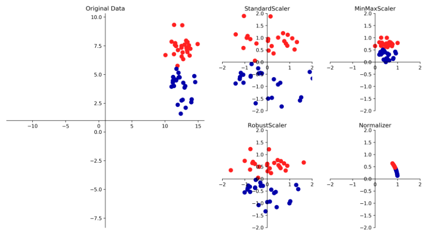

数据预处理和缩放


#### StandardScaler

-   确保每个特征的平均值为0、方差为1，使所有特征都位于同一量级，但是这种缩放不能保证特征的任何特定的最大值和最小值

#### RobustScaler

-   和StandardScaler类似，确保每个特征的统计属性都位于同一范围，使用的是中位数和四分位数，而不是平均值和方差，这样会忽略与其他店有很大不同的数据点，这些与众不同的点叫做异常值，可能会对其他的缩放造成麻烦

#### MinMaxScaler

-   移动数据，使所有特征刚好位于0到1之间，对于二维数组来说，所有的数据都包含在 x 轴0到1与y轴0到1之间

#### Normalizer

-   对每个数据点进行缩放，使得特征向量的欧式长度等于1，也就是将所有的数据点都投射到一个半径为1 的圆上





#### OneHotEncoder 独热编码

数据之间不存在关联性，使用矩阵表示

```python

from sklearn.preprocessing import LabelEncoder
from sklearn.preprocessing import OneHotEncoder

# 标签化处理，将文本变为数字
label_enc = LabelEncoder()
X_train_labeled = label_enc.fit_transform(X_train)
# 独热编码，转化为矩阵
oneHot = OneHotEncoder()
X_train_ = oneHot.fit_transform(X_train_labeled)
```

