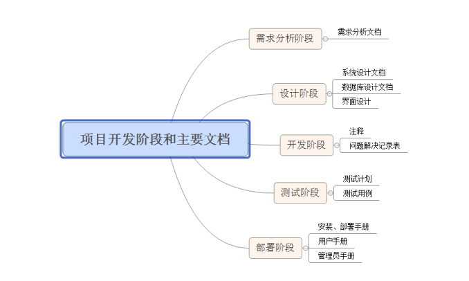
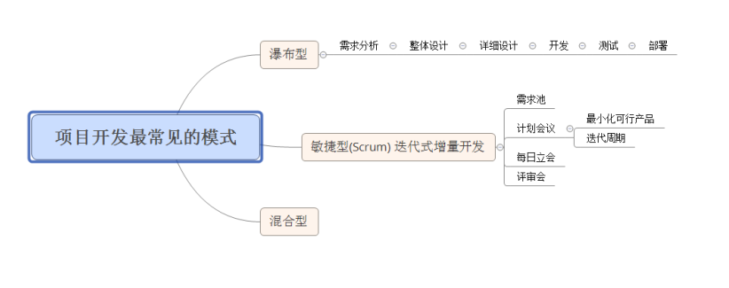
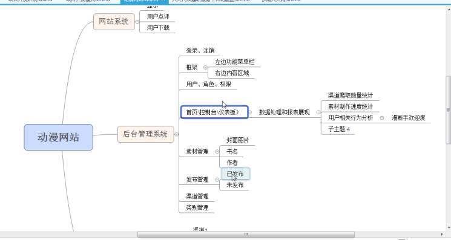
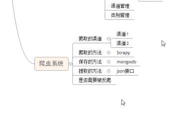

项目开发

新闻页面门户：一天，discuz 搭建论坛

OA

#### 需求分析阶段

-   需求分析文档，开发到客户现场实地调查访谈，1-2周。实地了解所有的需求，避免后期的需求BUG

#### 设计阶段

概要设计：原型图（acture），用户界面，数据库，架构设计，框架选择

详细设计：

-   系统设计文档
-   数据库设计文档
-   界面设计

#### 开发阶段

-   ​

系统架构，界面风格UI 界面原型，需求分析文档（自己，和客户打交道）

#### 开发模式

-   瀑布型：开发时间长，迭代周期长，几个月验收一次
-   敏捷型：scrum 迭代式增量开发， 结对编程，代码重构
    -   scrum master  证书，to_do  doing finish
    -   scrum 计划会议（1-2天） - 迭代周期（1-2周） - 每两周进行任务分配   - 每天大约 10 分钟进行会议，昨天做完了什么和今天做什么
    -   快速迭代，尽早避免错误
-   混合型：

BUG系统：

公司内部已配置好 账号 权限，已经有完善的系统

国内：

国外：

