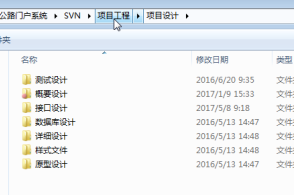
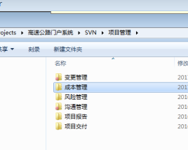
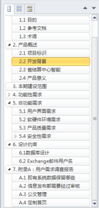
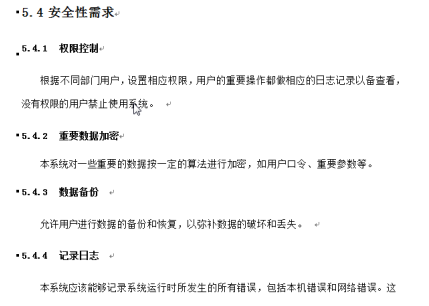
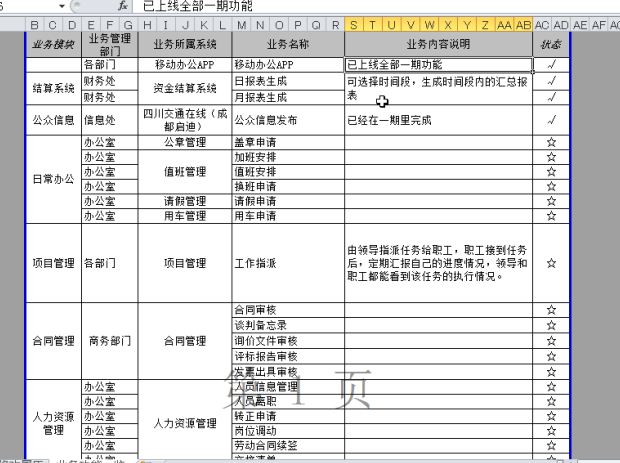
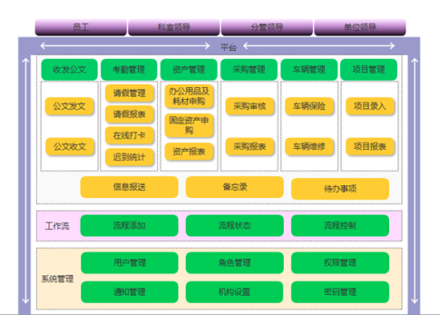

需求文档

版本控制系统：自建服务器，git server

#### 需求分析文档

-   功能性需求
    -   业务
-   非功能需求
    -   界面，软硬件性能，安全性等

#### EXCEL

#### 数据库设计

PDM

先进性

可扩展性

安全性

OA 满足50并发就可以

#### 系统部署

没有保密性：阿里云可以

保密性的系统：自建机房

服务器的机器宽度：一般 2U 宽度

CPU：4核  16G  1.6GHZ   戴尔，采购方便，机器都是一样的， 2-3万

操作系统：Linux   CentOS 比较稳定，Ubantu

部署方法：

-   ​

安装部署手册：记录部署流程

字典管理：