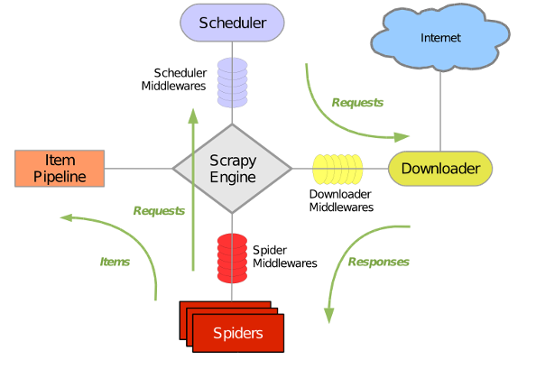

Scrapy

​	一个为爬取网站数据， 提取结构新数据而产生的应用框架， 可以应用在包括数据挖掘， 信息处理或历史存储历史数据的一系列过程中。

Scrappy使用了Twisted异步网络请求库来处理网络通讯， 大致结构如下




安装

-    `pip install scrapy`


开启一个项目

-   `scrapy startproject YourProject`


运行项目

-   在 爬虫的文件目录下， `scrapy crawl qidian`


```python

import scrapy
from scrapy.selector import Selector


class QiDianSpider(scrapy.spiders.Spider):
    # 启动项目制定的name参数
    name = 'qidian'
    # 需要爬取的页面
    start_urls = {
        'https://www.qidian.com/',
    }

    # 解析页面
    def parse(self, response):
        print('-*' * 40)
        # 请求时的 url
        current_url = response.url
        # 返回的 THML 页面
        body = response.body

        # 返回的html unicode编码
        unicode_body = response.body_as_unicode()

        # 小说分类信息
        res = Selector(response)
        menu_type = res.xpath('//*[@id="classify-list"]/dl/dd/a/cite/span/i/text()').extract()
        menu_type_href = res.xpath('//*[@id="classify-list"]/dl/dd/a/@href').extract()
        print(menu_type, menu_type_href)
        print('<<<<' * 40)
        return response
```


代码上线

-   虚拟环境  ——> [dockor](https://hub.docker.com)