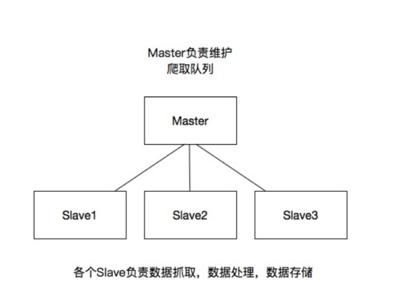

分布式

#### 分布式和集中式对比

#### 集中式系统：

-   整个系统就是一个独立的应用，整个应用也就是整个项目，所有

的业务逻辑功能都在一个应用里面。如果遇到并发的瓶颈的时候，就多增加几台服务器来部署项目，以此来解决并发分问题。在nginx中进行负载均衡即可。

缺点：

>   a) 不易于扩展
>
>   b) 如果发现你的项目代码中有bug的话，那么你的所有的服务器中的项目代码都是有问题的，这时候要更新这个bug的时候，就需要同时更新所有的服务器了。

优点：

-   维护方便

#### 分布式系统

-   将整个项目拆分为很多个业务模块，每个业务单独进行集群部署，将各个模块之间进行了解耦合，项目很容易进行横向的拓展，也可以很好的将用户的并发量提升上去。

缺点：

>   a) 项目拆分的过于复杂，给运维带来了很高的维护成本

>   b) 数据的一致性，分布式事务，分布式锁等问题不能得到很好的解决

优点：

>   a) 一个业务模块崩了，并不影响其他的业务

>   b) 利于扩展

>   c) 在上线某个新功能的时候，只需要新增对应的分布式的节点即可，测试也只需要测试该业务功能即可。很好的避免了测试在上线之前需要将整个系统进行全方面的测试

scrapy_分布式示意图

-   Master 负责 Request 产生请求地址, 并放入队列中
-   slave 负责从请求队列中获取请求，执行下载

==从机==配置 没有  master

-   REDIS_START_AS_SET 存入redis 的数据的格式

==主机==配置

