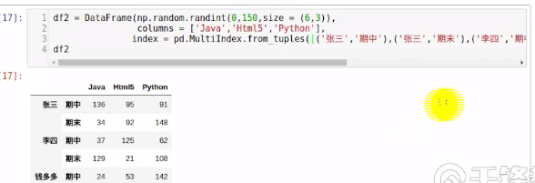
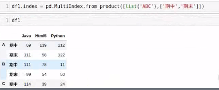

## DataFrame

[TOC]

列索引

df[""]  df.column

- 可以用类似字典的方式进行索引， 得到的是一个Series 对象
- 列就相当于DataFrame 的属性， DataFrame 是统计数据时的表格， 某个属性就对应一个DataFrame 的列
- 列 无法进行切片，但是不会出错，还是在行里面进行切片，所以返回的值是空的


行索引

-   `.loc[]  .iloc[]`  
-   行的检索返回值也是一个 Series 
-   检索多行  `df.loc[["A", "B"]]` 得到  DataFrame
-   loc 切片  前闭后闭
-   隐式索引 `.iloc[]`  左闭右开

有时无法检索汉字索引， 有个别字无法检索


定位索引，赋值

-   `df["column"]["index"] = '赋值'`

检索行是可以多个参数， 但是列索引使不行的

-   `df.loc["index", "column"]`

values 取值

-   `df.values[0,3]`


-   索引使行列索引
-   切片是行切片


### 运算

DataFrame 之间的运算, 自动对齐对应的数字， 没有补充 NaN

-   `df1 + df2`  对应的数据相加， 空值会出现 NaN，避免出现NaN
-   `df1.add(df2, fill_value=0)` 对 df2 中的空值 NaN, 填充 0
-   `pd.add`


#### Pandas 的聚合函数

-   要指定 axis 轴
-   `df1.add(data, axis=["columns","index", 0, 1])`


### 数据丢失处理


-   None  NoneType 类型
-   np.nan(NaN)  浮点型

数据类型不同，运算时间也不同


数据清洗， 处理空值

`isnull() notnull() dropna()`

-   `df=DataFrame(...)`
-   `df.isnull()` 得到是空值的地方为 True
-   any()  有一个为 True 则为 True， 在不指定 axis 的情况下，首先检查的是列，  
-   `s1= df.isnull().any(axis=1)`
-   `df[s1]` 得到空值的列
-   all() 所有为 True 才是True

删除和填充空值

-   `dropna()` 默认删除为空值的行， axis =1 删除的是列
    -   `df.dropna()` 删除有空值的行， how=“all"  全部是空才删除
-   `fillna(value=0)` 指定值来填充空数据
    -   `df.fillna(method="bfill ffill")` backfill=bfill  pad=ffill, 取前面或者后面的值来填充空值， 默认是列的方向
    -   `df.fillna(method="fill", inpalce=True)`  对原来的对象进行修改，不产生新的对象


#### 傅里叶变换, 进行图像轮廓突出显示

摄像头捕获画面的轮廓进行识别， 通过图像中的数据变化剧烈程度

傅里叶变换：将时域装化为频域

```python

# 导入傅里叶变换， ifft 傅里叶反转
from numpy.fft import fft, ifft
from PIL import Image


cat = Image.open("cat.png")
cat.show() # 展示

# int8 < 128  大于的表示为 负数
cat_data = np.fromstring(cat.tobytes(), dtype=np.int8) # 将图片数据读取转换为 bytes
cata_data_fft = fft(cat_data)  #傅里叶变化转化为频域
# 将里面的低频的数据设置为0， 地坪表示数据的变化不大，高频代表陡变
# 1e5 = 100000
np.where(np.abs(cata_data_fft)<le5, 0, cata_data_fft)
# 和上面的相同，将小于 100000 的值赋值为0
cat_data_fft[np.where(np.abs(cat_data_fft)<1e5)] = 0

# 反转数据
cat_data_ifft = ifft(cat_data_fft)
# 得到有实部和虚部的数据
# 处理虚部
cat_data_real = np.real(cata_data_ifft)
# 去除小数部分
cata_data_result = np.int8(cat_data_real)

# 转化为图片
cat_Image = Image.frombytes(data=cat_data_result, size=cat.size, mode=cat.mode)
# 显示
cat_Image.show()
```

有实数和虚数


### 多层索引


#### 创建多层索引

Series 多层索引


DataFrame多层索引：隐式构造


#### datafrme 显示构造索引


#### 多层索引

from_arrays


元祖创建， 多个元祖放在列表中进行创建




使用 product


index和columns 都可以使用多层索引


#### 多层索引获取数据


切片

`s.iloc[0:3]`


#### DataFrame操作

df1





对于二维的索引，在进行切片时，如果有中文，有 Bug,无法切片


#### 索引的堆 (stack)

*   stack()
*   unstack()

堆：先进后出， 

*   level 哪一个，哪个就消失，出现在另一个轴中， 默认是 -1
*   列的level,从上往下 0，1，2 . . . ，unstack() 时，行的索引也是相同的方法，
*   也可以使用 -1倒序进行查找 level


### 聚合操作

 axis 是哪个，那个就保留


std() 方差， 方差越大，数据越不稳定，说明数据的波动大


### 拼接操作


