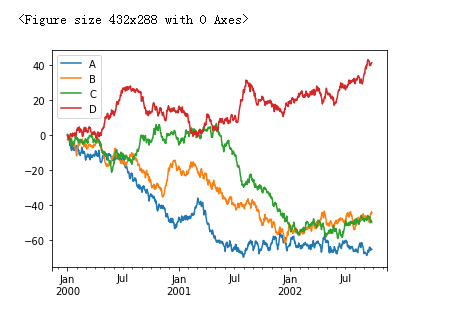

### 可视化

```python

ts = pd.Series(np.random.randn(1000), 
               index=pd.date_range("1/1/2000", periods=1000))
ts = ts.cumsum()
ts.plot()
```


```python

import matplotlib.pyplot as plt

df = pd.DataFrame(np.random.randn(1000, 4), 
                 index=ts.index, 
                 columns=["A","B","C","D"])
df = df.cumsum()
plt.figure()
df.plot()
plt.legend(loc="best")
```




### 读取和保存 csv 文件


```python
# csv
df.to_csv("test.csv")

pd.read_csv("test.csv")

# HDF5
df.to_hdf('foo.h5', 'df')
db.read_hdf("foo.h5", "df")

# Excel
写入
df.to_excel("foo.xlsx", sheet_name="Sheet1") # sheet1 2 3 4 5
读取
pd.read_excel("foo.xlsx", sheet_name="Sheet1", index_col=None,
             na_values=["NA"])
```

