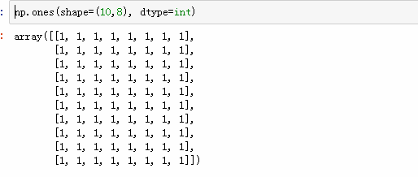
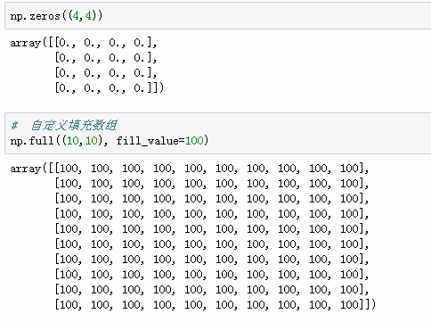
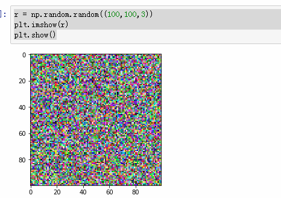

#### jupyter-notebook

Esc 退出编辑模式， 快捷键的功能

| 快捷键    | 功能                   |
| --------- | ---------------------- |
| b         | 当前单元格下面插入一行 |
| a         | 当前单元格上面插入一行 |
| dd        | 删除当前单元格         |
| y         | 当前单元格转为代码     |
| m         | markdown模式           |
| shift+tab | 查看文档               |
| tab+tab   | 补全                   |


关于创建数组时的数据类型的优先级

`str > float > int`


dtype 指定数据类型

order 表示保存的数据类型

数据类型

```python
np.int8   np.int16 等表示的是数据占用的内存

```


np.eye()  创建一个单位矩阵


np.linspace(start, stop, num)  将 start->stop 等分 num 份


np.logspace(start, stop, num)  将开始到结束均分， 这些值作为10的指数，求出的值为最后的结果


np.arrange(start, stop, step)  更具 step 来取值，最后一个取不到


np.random.randint(1, 10, size=(2, 3), dtype=np.int8)


np.random.randn(d1, d2, d3 ... dn) 产生传入几个参数就创建一个几维的数组,  里面是一个以0为中心的正态分布的随机值


np.random.normal(loc=10, scale=0, size=(2, 8))   

可以自己设定分布的中心和方差， loc 中心， scale  方差


np.random.random(size=(2, 3))  随机产生一个 0-1 填充的数组


png   0-1     颜色范围    255份

jpg   0-255

### 傅里叶变换
> 可以将图片的主要轮廓抠取出来


```python
np.__version__

# pyolotlib 显示画图 数据分析和可视化
import matplotlib.pyplot as plt

# 读取图片  得到的是数组   是一个 RGB 数组
cat = plt.imread('icon.jpg')
cat2 = cat - 200
plt.imshow(cat2)
plt.show()

# 形状
cat2.shape

r = np.random.random((100,100,3))
plt.imshow(r)
plt.show()
```


`n4 = np.array([1, 2, 3, 'python'])`

### 创建数组优先级 str > float> int 











## 级联
1. np.concatenate()
2. 参数必须是列表  一定要加中括号或小括号
3. 维度必须相同
4. 形状必须相同
5. 级联的方向默认是 shape 这个 tuple 的第一个值所代表的维度方向
6. 可通过 axis 参数改变级联的方向


