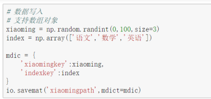
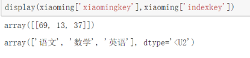

Scipy


#### 阿里镜像安装Scipy

`pip install scipy -i https://mirrors.aliyun.com/pypi/simple/`


##### [深入浅出讲解傅里叶变换](https://www.cnblogs.com/h2zZhou/p/8405717.html)


### 文件的输入输出

-  处理文本 ` import scipy.io as io`
-  处理图片  `import scipy.misc as misc`
-  把数据存储为 二进制的格式的数据 `io.savemat()`
-  读取二进制的数据文件  `io.loadmat()`


#### io

-   字典存储数据，二进制格式， 不需要指定文件的文件名，自动保存为 `.mat`



-   读取二进制文件

```python
xiaoming = io.loadmat("xiaomingpath.mat")
display(xiaoming["xiaomingkey"], xiaoming["indexkey"])
```




