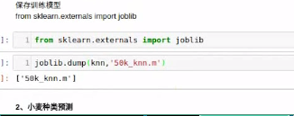

#### 有监督

- 有答案的
- 商用最多的，主要是分类

#### 无监督

- 没有答案

#### 半监督

- 部分有答案
- 使用有答案的数据进行训练模型，然后使用陌生数据进行验证

#### 分类问题

- kNN
- 贝叶斯
- svm

#### 回归问题

- 线型回归
- 岭回归
- 逻辑斯蒂回归，也可以处理分类问题，回归算法处理分类问题

#### 聚类算法

k_means()

用户定位，分类，契合产品的需求，将不同价位的产品推送给不同的用户

#### 深度学习

算法的组合

通过将样本拆分成不同的类型进行不停的学习

#### kNN

k近邻算法

##### 距离

- 抽象的问题

保存模型和加载保存的模型

