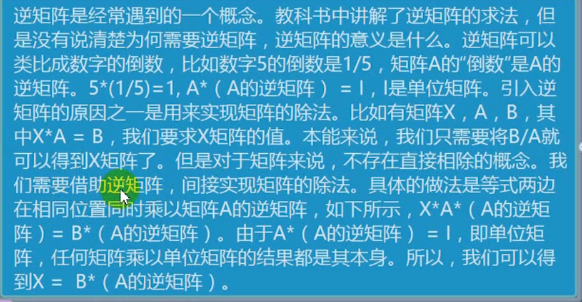

线性回归

满秩矩阵

- 矩阵内部进行四则运算时后，行数和列数还是相同的
- 满秩矩阵求解释最精确的

奇异矩阵

- 该矩阵不是满秩的，线性代数的概念
- 奇异矩阵可以通过岭回归求解

判断满秩矩阵

- `np.linalg.martrix_rank(ndarry)` 查看矩阵的秩，和数组的 shape 进行对比

矩阵的逆

- 矩阵本身和自身的逆矩阵相乘得到的是单位矩阵

求矩阵的的逆矩阵

`n_T = np.linalg.inv(ndarray)`

#### 岭回归

岭回归是加了二阶正则项的最小二乘， 主要是用于过拟合严重和存在多重共线性，岭回归室友 bias 的，这里的 bias 是为了 vanance 更小

- 过拟合严重： x + y = 1  2x + 2y = 2
- 多重共线： 两个正相关的属性，同时对结果进行求解
- bias ：偏差
- vanance：

一般用于样本值不够的时候

